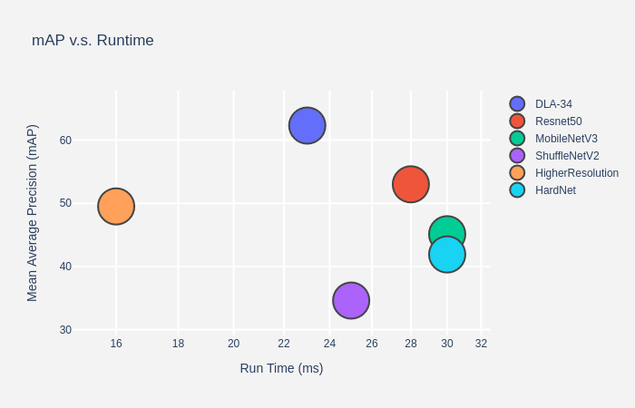
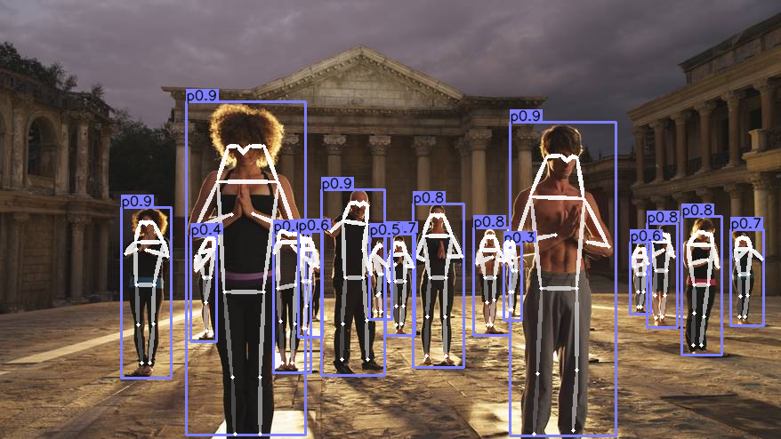

# The repo is based on [CenterNet](https://arxiv.org/abs/1904.07850), which aimed for push the boundary of human pose estimation
multi person pose estimation using center point detection:


## Main results

### Keypoint detection on COCO validation 2017
<p align="center"> </p>

| Backbone     |  AP       |  FPS         | TensorRT Speed | Download |
|--------------|-----------|--------------|----------|----------|
|DLA-34        | 62.3      |    23      |  - |[model](https://drive.google.com/open?id=1OkHjjViB0dzbuicdtIam-YcoT0sYpmjP)  |
|Resnet-50     | 53.0      |    28      |  33 |[model](https://drive.google.com/open?id=190wRY7V2qPFf57WAreVAQrN1LPzjeM9e)  |
|MobilenetV3   | 45.1      |    30      |  - |[model](https://drive.google.com/open?id=1VdBEh8XisujRZ4zvxLcvJ-R8dtY3CC-x)  |
|ShuffleNetV2  | 34.6      |    25      |  - |[model](https://drive.google.com/open?id=12ENL9Qpsp__qHN5mb5E-Gex0sVbGeaD9)  |
|[High Resolution](https://github.com/HRNet/Higher-HRNet-Human-Pose-Estimation)| 49.5     |    16      |  - |[model](https://drive.google.com/open?id=1gKcfMQx2_lRLTQhzvtRQKvJUkPLS2Lpn)  |
|[HardNet]()| 39.1     |    30        | -  |[model](https://drive.google.com/open?id=12JezItTw5rXoQ9dwxRBf4mn8iqHYgNTd)  |

## Installation

git submodule init&git submodule update
Please refer to [INSTALL.md](readme/INSTALL.md) for installation instructions.

## Use CenterNet

We support demo for image/ image folder, video, and webcam. 

First, download the model [DLA-34](https://drive.google.com/open?id=1OkHjjViB0dzbuicdtIam-YcoT0sYpmjP)
from the [Model zoo](https://drive.google.com/open?id=1UG2l8XtjOfBtG_GLpSdxlWS2wxFR8hQF) and put them in anywhere.

Run:
    
~~~
cd tools; python demo.py --cfg ../experiments/dla_34_512x512.yaml --TESTMODEL /your/model/path/dla34_best.pth --DEMOFILE ../images/33823288584_1d21cf0a26_k.jpg --DEBUG 1
~~~
The result for the example images should look like:
<p align="center"> </p>

## Training

After [installation](readme/INSTALL.md), follow the instructions in [DATA.md](readme/DATA.md) to setup the datasets.

We provide config files for all the experiments in the [experiments](experiments) folder.

```
cd ./tools python -m torch.distributed.launch --nproc_per_node 4 train.py --cfg ../experiments/*yalm
```

## License

MIT License (refer to the LICENSE file for details).

## Citation

If you find this project useful for your research, please use the following BibTeX entry.

    @inproceedings{zhou2019objects,
      title={Objects as Points},
      author={Zhou, Xingyi and Wang, Dequan and Kr{\"a}henb{\"u}hl, Philipp},
      booktitle={arXiv preprint arXiv:1904.07850},
      year={2019}
    }
